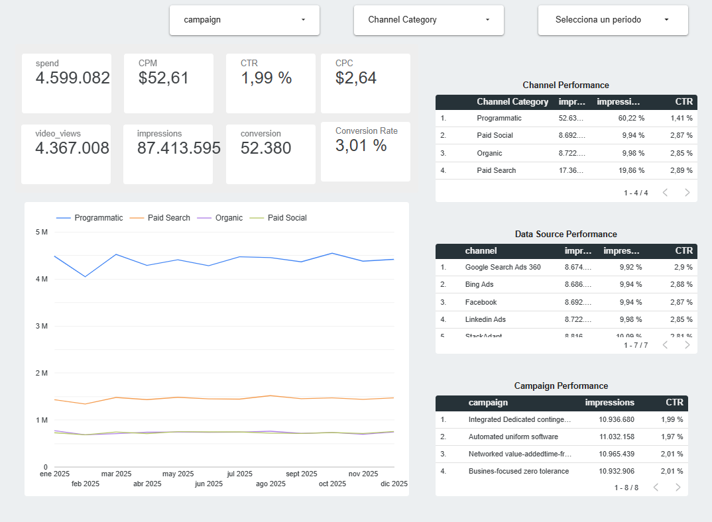

# Data-Pipeline-Monitoring & Marketing Analytics

## 🔗 Enlaces del Proyecto
* **Dashboard Interactivo:** [Haz clic aquí para ver el Dashboard en Looker Studio] https://datastudio.google.com/s/kuYrGATk5pQ
* **Explicación Técnica (Video):** [Ver video con el recorrido del proyecto] https://drive.google.com/file/d/16l6hxJmyY8lbFAk6_XeNnyXIKh9iKpLJ/view?usp=drive_link
* 

## 📝 Propósito Técnico
Este proyecto demuestra la capacidad de estructurar, limpiar y visualizar flujos de datos dinámicos. El enfoque principal fue asegurar la **integridad de los datos** y la precisión de los KPIs mediante la transformación de datos brutos en una herramienta de monitoreo interactiva y confiable.

## 🛠️ Stack Tecnológico
* **Fuente de Datos:** Google Sheets (Estructuración y normalización).
* **Visualización:** Looker Studio (Dashboard interactivo).
* **Capa de Lógica:** Campos calculados en Looker para optimización de rendimiento.

## 🛡️ Higiene y Validación de Datos (Data Quality)
Para garantizar reportes exactos y evitar la corrupción de información, se aplicaron las siguientes reglas de calidad:
- **Consistencia Cronológica:** Estandarización de formatos de fecha para asegurar la precisión en series de tiempo.
- **Normalización de Strings:** Transformación de nombres de campañas para evitar duplicidad por Case-Sensitivity (ej. Campaña_A vs campaña_a).
- **Integridad de Registros:** Validación de campos críticos y manejo de valores nulos (Null Handling) para prevenir errores en los cálculos automáticos.

## 📊 Lógica de Métricas (KPIs)
La lógica matemática se implementó en la capa de visualización para permitir una granularidad dinámica y eficiente:
- **CTR (Click-Through Rate):** `SUM(Clicks) / SUM(Impressions)` -> Valida la efectividad del anuncio.
- **CPC (Costo por Clic):** `SUM(Inversión) / SUM(Clicks)` -> Mide la eficiencia del gasto.
- **CPM (Costo por mil):** `(SUM(Inversión) / SUM(Impressions)) * 1000` -> Analiza el costo de alcance.

---

## 🎯 Enfoque del Proyecto
Este repositorio no tiene como objetivo el diseño visual, sino la **validación y el análisis técnico de datos**. Se desarrolló como un ejercicio de **Ingeniería de Calidad (QA)** para demostrar habilidades en:
1. Identificación y resolución de inconsistencias en bases de datos.
2. Implementación de lógica de negocio robusta.
3. Creación de sistemas de monitoreo de métricas, competencias fundamentales para roles de **QA Automation y Site Reliability Engineering (SRE)**.
