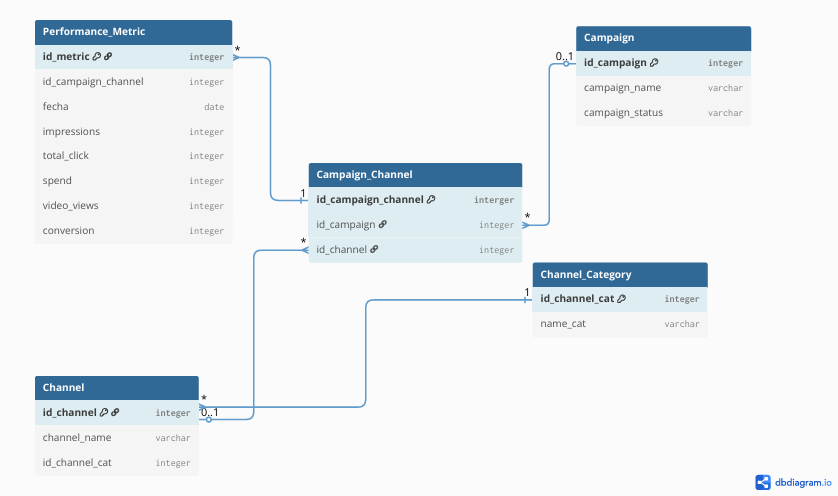

# ETL-Data-Validation-Pipeline

## Project Description
This project focuses on the design and implementation of an automated ETL (Extract, Transform, Load) pipeline to manage and analyze marketing campaign metrics. The system centralizes raw data from various sources, transforms it to ensure data integrity through 3NF normalization, and loads it into a robust SQL Server database for analysis and reporting.

## Technology Stack
- **Database:** Microsoft SQL Server (Express Edition).
- **Data Modeling:** dbdiagram.io (ERD Design).
- **Version Control:** Git & GitHub.
- **Processing Language:** Python (Pandas).

## Database Architecture
The database schema was designed following Third Normal Form (3NF) principles to minimize redundancy and maximize data consistency.

### Entity-Relationship Diagram (ERD)

## Project Structure
- `/database`: Contains the SQL scripts for DDL (Data Definition Language) and table constraints.
- `/docs`: Project documentation and architecture design.

### Project Status

* Architecture design and relational model.
* Database schema implementation (DDL).
* Header validation logic.
   * Missing headers (full and partial detection)
   * Duplicate header detection
   * Vertical/Horizontal offsets
   * Automatic cleanup of extraneous columns
* Refactor from spaghetti if/elif/else logic into modular functions — completed and validated, including the combined "Frankenstein case" (TC19).
* Parameterized file/sheet loading (`load_sheet_data`) — completed.
* [/] Orchestrator function to chain all validation logic (load → header detection → filter → missing/duplicate check) — in progress.
* Database integration of validated data.

All test cases are self-designed using a combinatorial decision-table approach, and the suite is continuously updated as new edge cases are identified.

Developed as part of my continuous improvement in Data Engineering and Quality Assurance.
